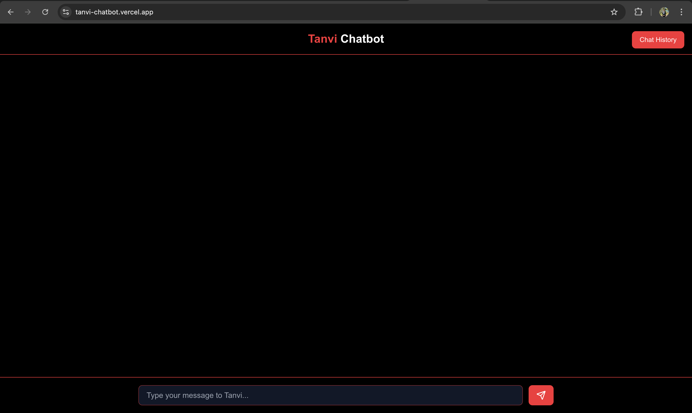
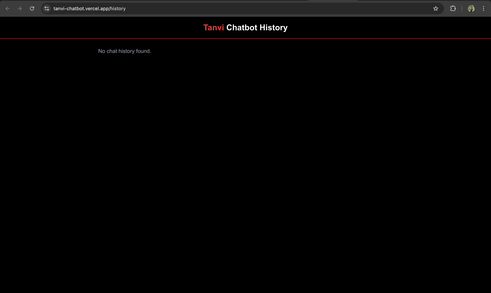

### ✅ `tanvi-chatbot-frontend/README.md`

```markdown
# 💬 Tanvi AI Chatbot – Frontend

A sleek, responsive AI Chatbot frontend built using **Next.js (App Router)** and **Tailwind CSS**. This interface allows users to interact with an AI assistant and track their chat history, delivering a clean and intuitive user experience.

---

## 🌐 Live Demo

- 🔗 **Frontend**: [https://tanvi-chatbot.vercel.app](https://tanvi-chatbot.vercel.app)
- 🔗 **Chat History Page**: [https://tanvi-chatbot.vercel.app/history](https://tanvi-chatbot.vercel.app/history)
- 🔗 **Backend**: Integrated with Spring Boot API

---

## 📸 Screenshots

| Chat UI                     | Chat History UI              |
|----------------------------|------------------------------|
|  |  |

---

## 🔥 Features

- 💬 Chat interface using React + Next.js
- 🧠 AI-powered answers via backend API
- 📚 View full chat history from localStorage
- 🎨 Tailwind CSS for clean, responsive UI
- 🚀 Deployed on Vercel

---

## 🛠️ Tech Stack

- Next.js 14 (App Router)
- React.js
- Tailwind CSS
- TypeScript
- Zustand or `localStorage`
- Heroicons

---

## 📁 Folder Structure

```

tanvi-chatbot-frontend/
├── public/
│   ├── ss1.png                # Chat UI screenshot
│   └── ss2.png                # History UI screenshot
│
└── src/
├── app/
│   ├── page.tsx           # Main Chat UI
│   └── history/
│       └── page.tsx       # Chat History UI
│
└── components/
├── ChatBox.tsx
├── Sidebar.tsx
├── Header.tsx
└── MessageBubble.tsx

````

---

## 🚀 Getting Started (Local Setup)

### 🔧 Prerequisites

- Node.js ≥ 18
- npm or yarn installed

### 📥 Installation

```bash
git clone https://github.com/TanviSharma21/tanvi-chatbot-frontend.git
cd tanvi-chatbot-frontend
npm install
npm run dev
````

Visit [http://localhost:3000](http://localhost:3000) in your browser.

---

## 🌐 Deploying on Vercel

1. Push the repo to GitHub
2. Go to [vercel.com](https://vercel.com) and import the project
3. Add this Environment Variable:

```env
NEXT_PUBLIC_BACKEND_URL=https://your-backend-url/api/chat/send
```

4. Deploy 🚀

---

## ✅ Post Deployment Checklist

| Checkpoint      | Description                   |
| --------------- | ----------------------------- |
| `/`             | Chat interface functional     |
| `/history`      | Chat history shown properly   |
| API Integration | Real AI response from backend |
| Responsive UI   | Works on mobile and desktop   |

---

## 🔁 Backend Integration

* Backend is built in Spring Boot
* Frontend expects this endpoint:

```
POST https://your-backend-url/api/chat/send
Body: {
  message: "Hello"
}
```

* Returns AI-generated response

> Add this backend URL in `.env`:
>
> ```bash
> NEXT_PUBLIC_BACKEND_URL=https://your-backend-url/api/chat/send
> ```

---

## 👩‍💻 Author

**Tanvi Sharma**
🔗 [GitHub](https://github.com/TanviSharma21)
🔗 [LinkedIn](https://www.linkedin.com/in/tanvi-sharma-b36313212)

---

## 📄 License

MIT License © 2025 Tanvi Sharma

```

---

Let me know if you want the **backend `README.md`** now too – I’ll tailor it the same way.
```
